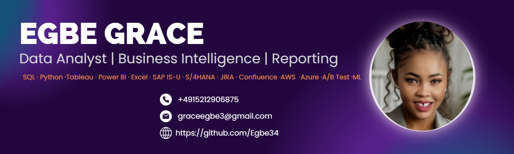

  

---

## 👋 About Me
I’m **Egbe Grace**, a Data Analyst with a strong background in **Business Intelligence, Reporting, and Process Optimization**.  
I specialize in turning raw data into business insights using **SQL, Python, Power BI, Tableau, and Excel**.  
I also bring experience with **SAP IS-U, S/4HANA, JIRA, Confluence, and MAKO**, supporting data-driven decisions across multiple domains.

---

##  Skills & Tools

### Analytics & BI  

  
  
  
  
  

### Enterprise Tools  

  
  
  
  
  

### Cloud & DevOps  

  
  
  
  

---

##  Highlight Projects
-  **[GA4 E-commerce Analytics](https://github.com/Egbe34/ga4-ecommerce-analytics)** — BI dashboards + ML + FastAPI (end-to-end pipeline).  
-  **[Global Superstore](https://github.com/Egbe34/final-project-global-superstore)** — SQL + Python + Power BI dashboards.
-  **[HR Analytics](https://github.com/Egbe34/HR-analytics)** — Attrition analysis, KPIs, and Tableau dashboards with Python & Excel integration.
-  **[Vanguard A/B Testing](https://github.com/Egbe34/project5_group3_vanguard)** — CX metrics, hypothesis testing, and recommendations.  
-  **[SQL Portfolio](https://github.com/Egbe34/sql-portfolio)** — KPI, retention, churn, RFM, and Pareto analysis.

---

##  GitHub Stats

  
  

---

##  Connect with Me
-  Email: **graceegbe3@gmail.com**  
-  GitHub: [github.com/Egbe34](https://github.com/Egbe34)  
-  Phone: **+49 152 1290 6875**  
